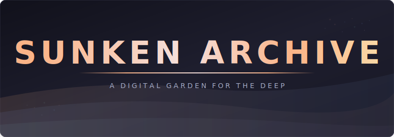

<div align="center">

<picture>
  <source media="(prefers-color-scheme: dark)" srcset="assets/banner.svg">
  <source media="(prefers-color-scheme: light)" srcset="assets/banner.svg">
  
</picture>

<br>

**A personal knowledge base and digital garden built on Quartz**

[](https://quartz.jzhao.xyz)
[](https://nodejs.org)
[](LICENSE.txt)

Notes, projects, tools, and references — organized and published as a searchable static site. Catppuccin Mocha themed. Dark mode only.

</div>

---

## Table of Contents

- [Highlights](#highlights)
- [Quick Start](#quick-start)
- [Project Structure](#project-structure)
- [Content](#content)
- [Customizations](#customizations)
- [Vendor Assets](#vendor-assets)
- [Deployment](#deployment)
- [License](#license)

---

## Highlights

<table>
<tr>
<td width="50%">

### Digital Garden

Interconnected notes with wikilinks, backlinks, and popover previews. Content grows organically across concepts, projects, daily logs, and reference material.

</td>
<td width="50%">

### Interactive Tools

Standalone HTML utilities embedded directly into the site — subnet calculator, regex tester, cron parser, password analyzer, and more. No external dependencies.

</td>
</tr>
<tr>
<td width="50%">

### Catppuccin Mocha

Full Catppuccin Mocha color scheme across the entire site. Dark mode only — light mode is disabled. Syntax highlighting, UI elements, and OG images all follow the palette.

</td>
<td width="50%">

### Full-Text Search

Client-side search powered by FlexSearch. Instant results across all notes, tags, and content with zero server-side infrastructure.

</td>
</tr>
<tr>
<td width="50%">

### Graph View

Interactive knowledge graph showing relationships between notes. Explore connections visually with D3-powered force-directed layouts.

</td>
<td width="50%">

### Obsidian Compatible

Author content in Obsidian with full support for callouts, wikilinks, tags, LaTeX, Mermaid diagrams, and frontmatter. Publish directly from your vault.

</td>
</tr>
</table>

---

## Quick Start

### Prerequisites

| Requirement | Version | Notes               |
| ----------- | ------- | ------------------- |
| Node.js     | 22+     | See `.node-version` |
| npm         | 10.9+   | Bundled with Node   |

### Install & Run

```bash
git clone https://github.com/Real-Fruit-Snacks/Sunken-Archive.git
cd Sunken-Archive
npm install
npx quartz build --serve
```

The site will be available at `http://localhost:8080`.

### Common Commands

```bash
npx quartz build --serve     # Dev server with hot reload
npx quartz build             # Production build to ./public
npx quartz sync              # Sync content changes
npm run check                # TypeScript + Prettier check
npm run format               # Auto-format with Prettier
```

---

## Project Structure

```
.
├── content/                 # Markdown notes (Obsidian vault)
│   ├── Concepts/            # Technical concepts and references
│   ├── Daily/               # Daily logs
│   ├── Meta/                # Site documentation
│   ├── Projects/            # Project notes
│   ├── Resources/           # Bookmarks and references
│   ├── Tools/               # Interactive tool pages
│   └── index.md             # Landing page
├── quartz/                  # Quartz engine (customized)
│   ├── components/          # UI components (Preact)
│   ├── plugins/             # Transformers, filters, emitters
│   ├── static/              # Static assets and tool HTML
│   │   ├── fonts/           # Vendored Google Fonts (woff2)
│   │   ├── katex/           # Vendored KaTeX CSS, JS, fonts
│   │   └── vendor/          # Vendored Mermaid ESM bundle
│   └── styles/              # SCSS stylesheets
├── scripts/                 # Build/setup scripts
│   └── vendor-assets.sh     # Downloads vendored assets (run once online)
├── quartz.config.ts         # Site configuration
├── quartz.layout.ts         # Layout configuration
└── assets/                  # Repository assets (banner, etc.)
```

---

## Content

| Section       | Description                                                   |
| ------------- | ------------------------------------------------------------- |
| **Concepts**  | Docker, networking, and technical reference material          |
| **Daily**     | Date-stamped journal entries and daily logs                   |
| **Meta**      | Site documentation, feature showcase, workflow notes          |
| **Projects**  | Home lab, web development, and ongoing project documentation  |
| **Resources** | Curated bookmarks and external references                     |
| **Tools**     | Interactive browser-based utilities (subnet calc, regex, etc) |

---

## Customizations

This fork of Quartz includes the following modifications:

| Feature                   | Description                                                           |
| ------------------------- | --------------------------------------------------------------------- |
| **SVG Favicon**           | Custom anchor favicon generated from SVG via Sharp                    |
| **Robots.txt**            | Emitter plugin for search engine directives and sitemap               |
| **Variable Highlighting** | Wraps `<Variable>` placeholders in styled spans (prose and code)      |
| **Combined Code**         | Merges all code blocks on a page into a single copyable block         |
| **Dark Mode Only**        | Light mode disabled; both themes use Catppuccin Mocha                 |
| **Custom OG Images**      | Social preview images matching the site theme                         |
| **Offline Assets**        | Google Fonts, KaTeX, and Mermaid vendored locally — zero CDN requests |

---

## Vendor Assets

Fonts, KaTeX, and Mermaid are vendored in `quartz/static/` — the site makes zero CDN requests. Re-run `bash scripts/vendor-assets.sh` after upgrading dependencies to refresh them.

---

## Deployment

### GitHub Pages

The site deploys to GitHub Pages via a GitHub Actions workflow on push to `main`.

```
push to main → npm ci → quartz build → deploy to GitHub Pages
```

---

## License

[MIT](LICENSE.txt) — Quartz is created by [jackyzha0](https://github.com/jackyzha0).
