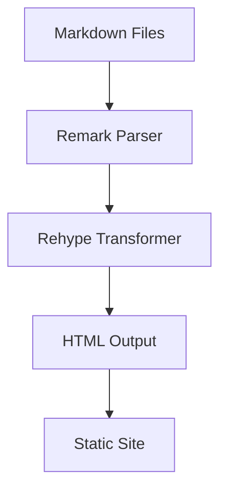
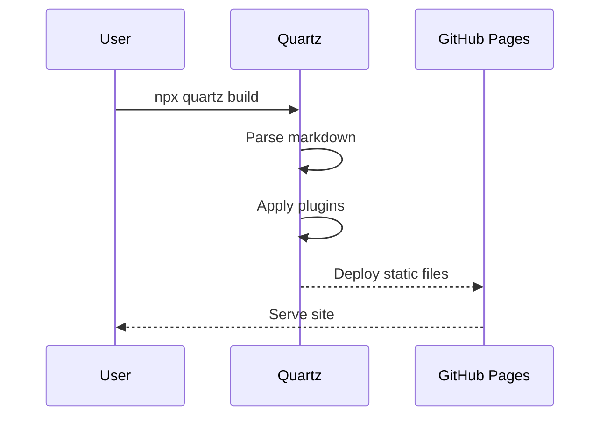

# Feature Showcase

This note exercises every rendering feature supported by the Sunken Archive. Use it to verify that the site is displaying everything correctly.

---

## Text Formatting

Regular text, **bold text**, *italic text*, ***bold italic***, ~~strikethrough~~, and ==highlighted text==.

Inline `code` looks like this. A `<Variable>` placeholder should render in red.

Arrows convert automatically: -> => <- <=>

%% This is an Obsidian comment — it should be invisible in the rendered output. %%

## Links

### Wikilinks

- Plain: [[Docker]]
- With alias: [[Docker|Container Notes]]
- With heading anchor: [[Networking#OSI Model]]
- External: [Quartz Documentation](https://quartz.jzhao.xyz)

## Footnotes

Quartz uses rehype for HTML processing[^1]. The site is built with Obsidian-flavored markdown[^2].

[^1]: rehype is a tool for transforming HTML with plugins.
[^2]: OFM extends standard markdown with features like wikilinks, callouts, and embeds.

## Block Reference

This paragraph has a block ID for referencing. ^showcase-block

## Lists

### Unordered
- First item
- Second item
  - Nested item
  - Another nested item
- Third item

### Ordered
1. Step one
2. Step two
3. Step three

### Task List
- [x] Completed task
- [x] Another completed task
- [ ] Pending task
- [ ] Another pending task

## Tables

| Feature | Status | Notes |
|---------|--------|-------|
| Wikilinks | Working | Supports aliases and anchors |
| Callouts | Working | All types rendered |
| Mermaid | Working | Flowchart, sequence, etc. |
| LaTeX | Working | KaTeX renderer |

## Code Blocks

### JavaScript
```javascript
function connect(config) {
  const url = `https://<APIHost>:<Port>/v1`;
  const token = config.get("<APIKey>");
  return fetch(url, { headers: { Authorization: token } });
}
```

### Python
```python
def deploy(server: str, port: int) -> None:
    """Deploy to <ServerName> on <Port>."""
    endpoint = f"https://<DeployTarget>:{port}/deploy"
    response = requests.post(endpoint, auth=("<Username>", "<Password>"))
    response.raise_for_status()
```

### Bash
```bash
#!/bin/bash
ssh <Username>@<ServerIP> -p <SSHPort> << 'EOF'
  sudo systemctl restart <ServiceName>
  echo "Deployed to <Environment>"
EOF
```

### YAML
```yaml
services:
  app:
    image: node:20-alpine
    ports:
      - "3000:3000"
    environment:
      NODE_ENV: production
      DB_HOST: <DatabaseHost>
```

### Diff
```diff
- const oldValue = "remove this";
+ const newValue = "add this instead";
```

## Callouts

> [!note] Standard Note
> This is a basic note callout.

> [!info] Information
> Provides additional context or details.

> [!tip] Helpful Tip
> A useful suggestion for the reader.

> [!warning] Warning
> Something to be cautious about.

> [!danger] Danger
> Critical information — proceed with care.

> [!bug] Known Bug
> Documenting a known issue.

> [!example] Example
> Demonstrates a concept with a concrete example.

> [!question] FAQ
> A frequently asked question with an answer.

> [!success] Verified
> This feature has been tested and confirmed working.

> [!failure] Known Issue
> This feature is not yet working as expected.

> [!todo] To Do
> A task that still needs to be completed.

> [!quote] Quote
> "The best way to predict the future is to invent it." — Alan Kay

> [!abstract] Summary
> A brief summary of the key points.

### Collapsible Callouts

> [!tip]+ Expanded by Default
> This callout starts open. Click to collapse.
> - Item one
> - Item two

> [!info]- Collapsed by Default
> This callout starts closed. Click to expand.
> Contains hidden details that aren't immediately visible.

## LaTeX Math

### Inline Math

The quadratic formula is $x = \frac{-b \pm \sqrt{b^2 - 4ac}}{2a}$ and Euler's identity is $e^{i\pi} + 1 = 0$.

### Block Math

$$
\int_{-\infty}^{\infty} e^{-x^2} dx = \sqrt{\pi}
$$

$$
\nabla \times \vec{E} = -\frac{\partial \vec{B}}{\partial t}
$$

## Mermaid Diagrams

### Flowchart


### Sequence Diagram


## Variable Highlighting

Variables in angle brackets should render in Catppuccin Mocha red:

- Connect to <ServerIP> on port <Port>
- Set <Username> and <Password> in the config
- Replace <API_Key> with your actual key
- The <DatabaseHost> variable in the YAML above should also be highlighted

## Transclusion

Embedding another note (if it exists):

![[How I Take Notes]]

## Tags in Body Text

Inline tags: #test #meta #showcase

## Horizontal Rule

Content above the rule.

---

Content below the rule.
